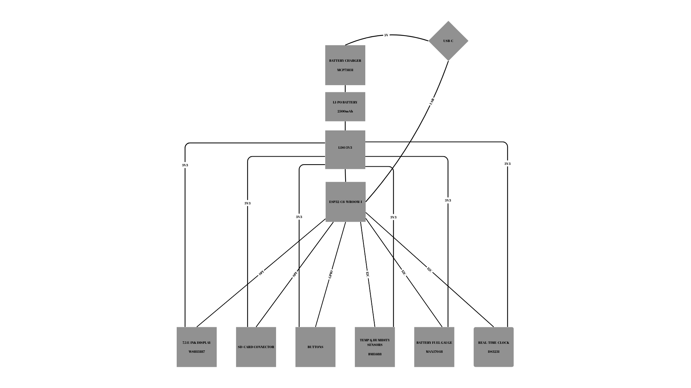

# Block Diagram

# Hardware Features – Detailed Description

## 1. Microcontroller – ESP32-C6

- **Processor:** 32-bit RISC-V core, clocked up to 160 MHz.
- **Memory:** 512KB internal SRAM and 8MB external flash memory (model W25Q512JVEIQ).
- **Connectivity:** Supports Wi-Fi 6 (802.11ax), Bluetooth Low Energy 5, and USB 2.0 (full-speed).
- **Interfaces:** SPI, I²C, UART, and multiple available GPIOs.
- **Power Efficiency:** Power-saving modes, including deep sleep.

## 2. E-Paper Display – 7.5”

- **Model:** Waveshare or equivalent, with a resolution of 800×480 pixels.
- **Connection:** 4-wire SPI plus control pins (CS, DC, RST, BUSY).
- **Power Consumption:** Very low in static mode; during refresh, consumption ranges between 15–25mA.

## 3. Environmental Sensor – BME688

- **Measurements:** Temperature, relative humidity, atmospheric pressure, and air quality (eCO2/VOC).
- **Interface:** I²C protocol at 400kHz (SDA/SCL).
- **Power Consumption:** Approx. 2.1µA in standby, with peaks of a few mA when active.

## 4. Power Supply and Management System

- **Battery:** Li-Po 3.7V, 2500mAh capacity.
- **Charging:** MCP73831 – simple and reliable IC for USB-C charging, up to 1A.
- **Monitoring:** MAX17048 – fuel gauge providing voltage and battery level data.
- **Voltage Regulation:** LDO such as XC6220A331MR-G, for a stable 3.3V output.

**Why these components?**
- MCP73831 offers a compact and efficient solution.
- MAX17048 enables precise battery monitoring and low-level warnings.

## 5. Buttons – 3 units

- **Type:** Tactile switch (Panasonic or similar).
- **Purpose:** Menu navigation, page turning, option selection.
- **Connection:** To GPIOs, with hardware (RC) or software debouncing.

## 6. USB-C Connector

- **Purpose:** Power/charging + data transfer via USB 2.0.
- **Protection:** ESD (e.g., USBLC6-2SC6Y) and termination resistors.
- **Options:** Supports firmware updates via USB or OTA via Wi-Fi.

## 7. Qwiic Interface (I²C)

- **Pins:** VCC, GND, SDA, SCL.
- **Functionality:** Quick expansion with additional I²C sensors/modules.

## 8. SD Card Slot – 112A-TAAR-R03

- **Purpose:** Storing e-books, logs, or firmware files.
- **Connection:** SPI or SDIO, depending on implementation.

## 9. Real-Time Clock – DS3231

- **Purpose:** Precise timekeeping, even without main power.
- **Communication:** I²C (shared with other sensors).
- **Backup:** Supercapacitor or secondary battery.

## 10. Additional Memory

- **Model:** W25Q512JVEIQ – external flash memory.
- **Connection:** Dedicated SPI (quad SPI) for firmware and large files.

---

# 4. ESP32-C6 Pin Allocation

| ESP32-C6 Pin | Function / Component          | Reason for Use                            |
|--------------|-------------------------------|--------------------------------------------|
| GPIO1        | I²C SDA                       | Data line for sensors and RTC              |
| GPIO2        | I²C SCL                       | Clock line for I²C interface               |
| GPIO5        | SPI MISO                      | Data input from e-paper                    |
| GPIO6        | SPI MOSI                      | Data output to e-paper                     |
| GPIO7        | SPI CLK                       | Clock signal for SPI                       |
| GPIO8        | SPI CS (e-paper)              | Chip select for display                    |
| GPIO9        | E-paper DC                    | Switch between data and command modes      |
| GPIO10       | E-paper RST                   | Hardware reset for the display             |
| GPIO11       | E-paper BUSY                  | Status signal (busy/free)                  |
| GPIO12       | Button 1                      | Digital input for NEXT                     |
| GPIO13       | Button 2                      | Digital input for PREV                     |
| GPIO14       | Button 3                      | Digital input for OK/MENU                  |
| GPIO15       | MAX17048 ALERT (optional)     | Low battery alert                          |
| GPIO16       | USB D+                        | USB data line (fixed pin)                  |
| GPIO17       | USB D-                        | USB data line (fixed pin)                  |
| GPIO18       | Status LED (optional)         | Visual indicator for various states        |
| GPIO19       | SD Card CS                    | Chip select for SD card (SPI)              |
| GPIO20       | SD Card MISO                  | Data received from SD card                 |
| GPIO21       | SD Card MOSI                  | Data sent to SD card                       |
| GPIO4        | SD Card CLK                   | SPI clock line for SD communication        |

---

# Power Consumption Estimate

| Module                | Typical Consumption              |
|------------------------|----------------------------------|
| ESP32-C6 active        | ~80mA with Wi-Fi / <10mA idle   |
| E-paper (refresh)      | 15–25mA                         |
| BME688 active          | up to 3.6mA / 2.1µA standby     |
| MAX17048               | Approx. 50µA                    |
| DS3231                 | ~3.5mA active / <1µA backup     |
| MCP73831               | Varies based on charging current|

**Usage Scenarios:**
- In **deep sleep**, total consumption can drop below 100µA.
- In active mode with Wi-Fi and screen refresh, consumption may reach 100–150mA.
- A 2500mAh battery allows for **weeks of operation** in predominantly passive mode (static display, infrequent Wi-Fi activity).

---

# Bill of Materials:

| **Piece Name**                          | **Piece Type**                      | **Link** |
|----------------------------------------|--------------------------------------|----------|
| ESP32-CAP C0402                        | C                                    | https://componentsearchengine.com/part-view/CC0402MRX5R5BB106/YAGEO |
| ADAFRUIT_CHIP-LED0603                  | LED                                  | https://www.snapeda.com/parts/KP-1608SURCK/Kingbright/view-part/?ref=search&t=LED%200603 |
| 112ATAARR03                            | microSD                              | https://www.snapeda.com/parts/112A-TAAR-R03/Attend/view-part/ |
| 744043680                              | L                                    | https://eu.mouser.com/ProductDetail/Wurth-Elektronik/744043680?qs=PGXP4M47uW6VkZq%252BkzjrHA%3D%3D |
| BD5229G-TR                             | Voltage Detector                     | https://www.snapeda.com/parts/BD5229G-TR/Rohm/view-part/?ref=search&t=BD5229G-TR |
| BUTTON_CUSYOMV1                        | Button                               | https://www.snapeda.com/search/?q=EVQP7L01P&search-type=parts |
| CPH3225A                               | C                                    | https://www.snapeda.com/parts/CPH3225A/Seiko/view-part/ |
| DS3231SN#                              | I²C-Integrated RTC/TCXO/Crystal      | https://www.snapeda.com/parts/DS3231SN%23/Analog%20Devices/view-part/?ref=search&t=DS3231SN%23 |
| ESP32-C6-WROOM-1-N8                    | ESP32                              | https://www.snapeda.com/parts/ESP32-C6-WROOM-1-N8/Espressif%20Systems/view-part/?ref=search&t=ESP32-C6-WROOM-1-N8 |
| ESP VARSISTOR                          | Varsistor (B72520T0350K062)                      | https://ro.mouser.com/ProductDetail/EPCOS-TDK/B72520T0350K062?qs=dEfas%2FXlABIszF52uu7vrg%3D%3D |
| ESP32_WROVER_AVX---SD0805S020S1R0      |  DIODE SCHOTTKY                       | https://componentsearchengine.com/part-view/SD0805S020S1R0/Kyocera%20AVX |
| ESP32_WROVER_BME680_BME680             | Env Senzor                            | https://www.snapeda.com/parts/BME680/Bosch%20Sensortec/view-part/?ref=search&t=bme680 |
| ESP32_WROVER_EAGLE-LTSPICE_R           | R                                    | https://componentsearchengine.com/part-view/R0402%201%25%20100%20K%20(RC0402FR-07100KL)/YAGEO |
| ESP32_WROVER_SPARKFUN-DISCRETESEMI_MOSFET_PCH | T DMG2305UX-7                 | https://componentsearchengine.com/part-view/DMG2305UX-7/Diodes%20Incorporated |
| ESP32_WROVER_SPARKFUN-IC-POWER_MCP73831 | TINY INTEGRATED LI-ION/LI-POLY CHARGE MGNT CONTROLLER | https://componentsearchengine.com/part-view/MCP73831T-2ACI%2FOT/Microchip |
| FH34SRJ-24S-0.5SH_99_                   | FH34SRJ-24S-0.5SH(99)               | https://componentsearchengine.com/part-view/FH34SRJ-24S-0.5SH(99)/Hirose |
| MAX17048G+T10                          |  Cell Fuel Gauge with ModelGauge     | https://www.snapeda.com/parts/MAX17048G+T10/Analog%20Devices/view-part/ |
| MBR0530                                |  Diode Schottky                      | https://www.snapeda.com/parts/MBR0530/Onsemi/view-part/ |
| PGB1010603MR                           |  Ipp Tvs Diode Surface Mount 0603    | https://www.snapeda.com/parts/PGB1010603MR/Littelfuse/view-part/ |
| QWIIC_CONNECTOR                        | PRT-14417 QWIIC_CONNECTOR                 | https://www.snapeda.com/parts/PRT-14417/SparkFun/view-part/ |
| RCL_CPOL-EU                            | C pol                                | https://grabcad.com/library/tantalum-smd-capacitor-type-b-3528-1 |
| SAMACSYS_PARTS_USB4110-GF-A            | USB4110-GF-A                         | https://www.snapeda.com/parts/USB4110-GF-A./Global%20Connector%20Technology/view-part/ |
| SJ                                     | Jumper-SolderPasteJumper3way         | https://grabcad.com/library/solder-jumpers-1 |
| TP                                     | Test-Pad                             | N/A |
| SI1308EDL-T1-GE3                       |  MOSFET Transistor                 | https://www.snapeda.com/parts/SI1308EDL-T1-GE3/Vishay/view-part/ |
| USBLC6-2SC6Y                           |  Ipp Tvs Diode Surface Mount                                    | https://www.snapeda.com/parts/USBLC6-2SC6Y/STMicroelectronics/view-part/?ref=dk&t=USBLC6-2SC6Y&con_ref=None |
| W25Q512JVEIQ                           | FLASH - NOR Memory                                 | https://www.snapeda.com/parts/W25Q512JVEIQ/Winbond%20Electronics/view-part/?ref=search&t=W25Q512JVEIQ |
| XC6220A331MR-G                         | Voltage Regulator              | https://ro.mouser.com/ProductDetail/Torex-Semiconductor/XC6220A331MR-G?qs=AsjdqWjXhJ8ZSWznL1J0gg%3D%3D&utm_source=octopart&utm_medium=aggregator&utm_campaign=865-XC6220A331MR-G&utm_content=Torex%20Semiconductor |
